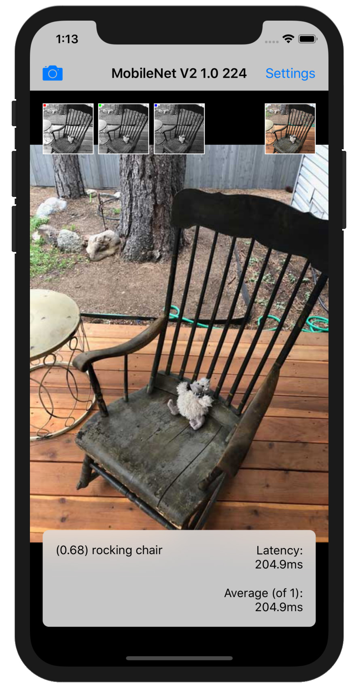
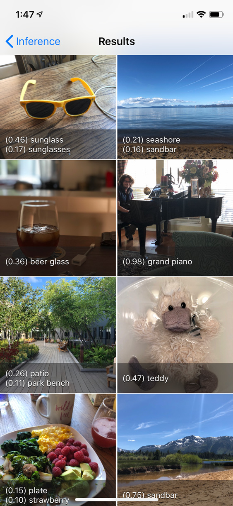

# Net Runner

[](https://travis-ci.org/doc-ai/net-runner-ios)

Net Runner is an iOS environment for running, measuring, and evaluating computer vision machine learning models on device. Net Runner currently supports TensorFlow Lite models and works on iOS 9.3 or higher. We've tested our models on devices as old as a 5th generation iPod touch. 

Data scientists can run their own models in Net Runner without needing to know any iPhone specific code, while developers will find a sophisticated and flexible library underneath the hood in the form of [TensorIO](https://github.com/doc-ai/TensorIO).

We happen to think it looks pretty good too. And if that latency number worries you, it's because this is a screenshot from the simulator. On an iPhone X, MobileNet V2 classification models perform inference in an impressive 40ms.

[Download Net Runner on the iOS App Store.](https://itunes.apple.com/us/app/net-runner-by-doc-ai/id1435828634?ls=1&mt=8)



## Table of Contents

* [ Overview ](#overview)
* [ Requirements ](#requirements)
* [ Installation ](#installation)
* [ Author ](#author)
* [ License ](#license)
* [ Data Scientists Start Here ](#data-scientists)
	* [ Freezing a Model ](#freeze-model)
	* [ Converting a Model to TensorFlow Lite ](#toco-convert)
	* [ Preparing a TF Lite Model for Net Runner ](#prep-net-runner) 
	* [ Adding a Model To Net Runner ](#add-model)
* [ Developers Start Here ](#developers)
* [ Basic Usage ](#basic-usage)
	* [ Model Evaluators ](#model-evaluators) 
	* [ TensorIO ](#tensor-io)
	* [ Adding Your Own Models ](#models-directory)
	* [ Custom Output ](#custom-output)
* [ Bulk Inference ](#bulk-inference)
* [ Headless Mode ](#headless-mode)
	* [ Evaluation Metric ](#evaluation-metric)
	* [ The Headless Directory ](#headless-directory)
	* [ The JSON Test File ](#test-json)

<a name="overview"></a>
## Overview

Net Runner is an environment for evaluating machine learning models on device. It enables the rapid prototyping and verficiation of computer vision machine learning models without a lot of boilerplate code. In fact, with the help of [TensorIO](https://github.com/doc-ai/TensorIO) you can run your vision models in Net Runner with just a little JSON.

In addition to supporting the live, visual verification of your models, Net Runner also supports bulk inference on device photo albums and a headless mode to evaluate the accuracy of your models by whatever metric you prefer. 

<a name="requirements"></a>
## Requirements

Net Runner requires iOS 9.3+ and Xcode Beta 10.

<a name="installation"></a>
## Installation

Clone or download this repo and run `pod install`. Open *Net Runner.xcworkspace* and build.

<a name="author"></a>
## Author

Philip Dow (philip@doc.ai)

<a name="license"></a>
## License

Net Runner is available under the Apache 2 license. See the LICENSE file for more info.

<a name="data-scientists"></a>
## Data Scientists Start Here

Net Runner is designed to be easy to use for computer vision data scientists and without the need for any TensorFlow Lite or iPhone specific code. That means no C, C++, Objective-C, or Swift. Instead, model builders describe their models using JSON with information that is already familiar to them, such as tensor shapes and data transformations.

There is still something of a process to get to that point, which looks like:

1. Develop your TensorFlow model
2. Save your model
3. Convert your saved model to a frozen model
4. Convert the frozen model to a TensorFlow Lite model
5. Prepare your TensorFlow Lite model for Net Runner

A guide to assist data scientists with these steps is forthcoming, but the following information will help you get started. See especially the [TF Lite Developer Guide](https://www.tensorflow.org/mobile/tflite/devguide) at tensorflow.org for information on freezing a model and converting it to the TensorFlow Lite format.

<a name="freeze-model"></a>
### Freezing a Model

Convert a saved model to a frozen model with the `freeze_graph` command line utility, which is included with python installations of TensorFlow. 

A frozen graph is one in which trainable variables have into transformed and "frozen" into constants that are then packaged into a single protobuf file along with the graph. It is a model format that is optimized for and suited to inference only.

<a name="toco-convert"></a>
### Converting a Model to TensorFlow Lite (TF Lite)

Once you have frozen your model convert it to the TensorFlow Lite format using the `toco` command line utility, also included with python installations of TensorFlow. 

TensorFlow Lite is a TensorFlow environment for mobile and embedded use cases and is how models are run on iPhone and Android devices. TensorFlow Lite models do not support all tensor operations, but most convolution operations are available, and if you are beginning with a MobileNet or Inception ResNet model you should be fine.

<a name="prep-net-runner"></a>
### Preparing a TF Lite Model for Net Runner

At this stage you could use your model with the TensorFlow Lite library directly, but that would involve programming in Objective-C++ for an iPhone and Java and C++ on Android. Instead, Net Runner uses [TensorIO](https://github.com/doc-ai/TensorIO), a framework also developed by doc.ai for the rapid deployment of TensorFlow Lite models to iOS devices.

With TensorIO you describe your model's input and output layers using JSON. Net Runner can then automatically prepare camera and image data for inference and capture your model's output in the correct format.

Refer to the included *.tfbundle* folders in the *models* directory found in this repo for examples, and see especially the [section on TensorIO](#tensor-io) below for details on preparing your TF Lite models for Net Runner.

<a name="add-model"></a>
### Adding a Model to Net Runner

You can download your own models directly into Net Runner. Make sure your model has been propertly prepared and is wrapped in a *.tfbundle* with a *model.json* description and any other assets, then zip the *.tfbundle* folder using a utility like gzip or the Finder's Compress utility. 

Upload the zipped bundle to web site you can access, and then from within Net Runner, go to Settings and tap the selected model. At the top right of the Models table, tap the Plus button. Enter the URL and then tap Import Model at the bottom of the screen.

Net Runner will download, unzip, and validate your model, and if it can be run in the app, will import it and make it available for selection and evaluation. Note that Net Runner is designed specifically for computer vision applications, so your models should take a single input of type image.

<a name="developers"></a>
## Developers Start Here

Net Runner is designed for turnkey use without the need to write any additional code. If you would, however, like to perform custom model evaluation, format your model's output in a more human readable way, or extend the underlying [TensorIO framework](https://github.com/doc-ai/TensorIO), some coding may be necessary.

By default, Net Runner displays a model's output using a propertly list representation. To format that output, refer to the section on [custom output](#custom-output).

Net Runner supports the headless evaluation of models. You may define an evaluation metric and then create test bundles with test examples and expected outputs to evaluate a model's accuracy. For more information on setting up custom evaluation metrics and running your own tests, see the section on Net Runner's [headless mode](#headless-mode).

If you would like to contribute to TensorIO, the underlying framework that allows users to describe their models with JSON rather than write custom Objective-C++ code, head on over to the [TensorIO repository](https://github.com/doc-ai/TensorIO).

<a name="basic-usage"></a>
## Basic Usage

Net Runner ships with four MobileNet models for image classification. The application launches with a MobileNet V2 model and the back facing camera feeding image data into it. The model can classify 1000 objects, and Net Runner shows the top five classifications with a probability over 0.1.

Net Runner measures the model's latency and continuously outputs an average value. On an iPhone X the average latency of the MobileNet V2 model should be ~40ms.

By default Net Runner performs inference on the data coming from the back camera. Swipe left or right on the preview to flip the camera. To pause the feed, tap the preview once, and tap it again to restart it.

To change the capture source, tap the camera icon at the top left. You may take a photo or choose a photo from the photo library on the device.

Along the top of the screen Net Runner shows the RGB channel previews and the image that the model actually sees after applying cropping and scaling.

Tap Settings to change the model you are running or to change UI preferences. You may also perform bulk inference on photo albums by tapping on *Evaluate Models* here.

<a name="model-evaluators"></a>
### Performing Inference: Model Evaluators

Net Runner defers all model inference to classes that implement the `Evaluator` protocol, and Net Runner includes support for evaluating album photos, files, instances of `UIImage`, and instances of `CVPixelBufferRef`. Support for performing inference on images identified by URLs is forthcoming. Ultimately, all model evaluators defer to the `CVPixelBufferEvaluator`, which performs inference on a pixel buffer. 

Evaluators return information such as the model output, latency, and image preprocessing latency, as well as a unique identifier such as the filepath or album photo id, and any errors that occurred. See the *Evaluation* group in the Xcode and especially *CVPixelBufferEvaluator.m* for more information.

<a name="tensor-io"></a>
### TensorIO

Net Runner includes [TensorIO](https://github.com/doc-ai/TensorIO) as a dependency. TensorIO is a framework for deploying TensorFlow Lite models on iOS. It abstracts the work of transforming data and copying bytes into and out of tensor buffers, replacing that with a native Objective-C interface and a JSON description of the underlying model.

The following JSON describes the MobileNet V2 model that ships with Net Runner. Notice in particular the *inputs* and *outputs* fields:

```json
{
  "name": "MobileNet V2 1.0 224",
  "details": "MobileNet V2 with a width multiplier of 1.0 and an input resolution of 224x224. \n\nMobileNets are based on a streamlined architecture that have depth-wise separable convolutions to build light weight deep neural networks. Trained on ImageNet with categories such as trees, animals, food, vehicles, person etc. MobileNets: Efficient Convolutional Neural Networks for Mobile Vision Applications.",
  "id": "mobilenet-v2-100-224-unquantized",
  "version": "1",
  "author": "Andrew G. Howard, Menglong Zhu, Bo Chen, Dmitry Kalenichenko, Weijun Wang, Tobias Weyand, Marco Andreetto, Hartwig Adam",
  "license": "Apache License. Version 2.0 http://www.apache.org/licenses/LICENSE-2.0",
  "model": {
    "file": "mobilenet_v2_1.4_224.tflite",
    "quantized": false,
    "type": "image.classification.imagenet"
  },
  "inputs": [
    {
      "name": "image",
      "type": "image",
      "shape": [224,224,3],
      "format": "RGB",
      "normalize": {
        "standard": "[-1,1]"
      }
    },
  ],
  "outputs": [
    {
      "name": "classification",
      "type": "array",
      "shape": [1,1000],
      "labels": "labels.txt"
    },
  ]
}
```

The model is used in Objective-C as follows:

```objc
UIImage *image = [UIImage imageNamed:@"example-image"];
TIOPixelBuffer *buffer = [[TIOPixelBuffer alloc] initWithPixelBuffer:image.pixelBuffer orientation:kCGImagePropertyOrientationUp];

NSDictionary *inference = (NSDictionary*)[model runOn:buffer];
NSDictionary<NSString*,NSNumber*> *classification = inference[@"classification"];
```

All that is required to use the underlying TensorFlow Lite model is that the model is included in the application inside a *.tfbundle* directory with this JSON description and any other assets, and then accessed via that bundle:

```objc
NSString *path = @"...";
TIOTFLiteModel *model = [TIOTFLiteModel modelWithBundleAtPath:path];
```

<a name="models-directory"></a>
### Adding Your Own Models

Net Runner automatically looks for *.tfbundle* folders inside the included *models* directory. It makes those models available for selection in Settings as well as for evaluation.

To add your own model to Net Runner, create a *model.json* file for it and include both the model and the JSON file in a *.tfbundle* folder. Add any additional assets, and then add the folder to the *models* directory. 

You do not need to add the folder to Xcode, as Xcode will automatically pick it up via a folder reference.

For example, the included MobileNet V2 model has the following directory structure:

```
- mobilenet_v2_1.4_224.tfbundle
  - mobilenet_v2_1.4_224.tflite
  - model.json
  - assets
    - labels.txt
```

If your model expects a single input layer of image data, Net Runner will know how to use it without any additional code. If you have a single output layer, you can probably get by with copying the *model.json* file from one of the included models and making small changes to it. Net Runner will then display your model's output at the bottom of the screen.

For more information on how to describe your model in the *model.json* file, and for additional details on packaging your models in a *.tfbundle* folder, refer to the [TensorIO documentation](https://github.com/doc-ai/TensorIO#model-json).

<a name="custom-output"></a>
### Custom Output

By default Net Runner outputs a property list representation of your model's output in the info section at the bottom of the screen. If you would prefer to format this output, create a class that conforms to the `ModelOutput` protocol and implement, specifically, the `localizedDescription` method.

You can then register your class with the `ModelOutputManager`. The manager uses the *model.type* field in the model's JSON description, so that you can register a single output class for multiple models.

```objc
+ (NSDictionary<NSString*,Class>*)classes {
    NSMutableDictionary<NSString*,Class> *classes = [[NSMutableDictionary alloc] init];
    
    classes[@"image.classification.imagenet"] = NSClassFromString(@"ImageNetClassificationModelOutput");
    // Add your model output class here
    
    return [classes copy];
}
```

<a name="bulk-inference"></a>
## Bulk Inference

Net Runner can perform bulk inference on the device's photo albums. Select *Settings* and tap *Evalute Models* under *Testing*. Follow the on screen instructions to select the models and albums you would like to perform inference with. You may then view the results in bulk and individually, which is nice way to develop a sense for how well your models are performing.



<a name="headless-mode"></a>
## Headless Mode

For a more rigorous assessment of your model's performance, headless mode supports the automatic evaluation of models on images that are included with the application. To use headless mode, switch the Build Scheme to *Net Runner Headless* at the top left of the Xcode window and add your custom test bundles to the *headless* directory included in the repository. 

<a name="evaluation-metric"></a>
### Evaluation Metric

You may also need to implement a custom evaluation metric that conforms to the `EvaluationMetric` protocol. See the *Evaluation Metrics* group in Xcode for more information. Specifically, an `EvaluationMetric` knows how to evaluate the results of a single inference and then aggregate and reduce those results to a single value, typically an average. When you create an evaluation metric you will implement two methods, `evaluate:yhat:` and `reduce:` that do just that.

See below for a description of how the included `EvaluationMetricAccuracyTop5` assess an image classification model's accuracy.

<a name="headless-directory"></a>
### The Headless Directory

Net Runner looks for *.testbundle* folders in the *headless* directory when performing headless evaluation. To add your own headless evaluation, create a *.testbundle* folder in this directory. There is no need to add this folder to Xcode, as the folder reference will automatically pick it up. The folder should have the following directory structure:

```
- myevaluation.testbundle
  - test.json
  - images
    - 01.jpg
    - 02.jpg
    - ...
```

<a name="test-json"></a>
### The JSON Test File

Inside your *.testbundle* you must have a *test.json* file as well as an images directory that contains the image files you will be performing inference on. The *test.json* file has the following basic structure. All fields are required.

```json
{
  "name": "Sample Test Bundle 2",
  "id": "sample-test-bundle-2",
  "version": "1",
  "models": [
    "inception-v4",
  ],
  "options": {
    "iterations": 1,
    "metric": "EvaluationMetricAccuracyTop5"
  },
  "images": [
    { },
  ],
  "labels": [
    { },
  ]
}
```

*name*, *id*, *version* 

The *name*, *id*, and *version* field are specific to your use case and may be any string value.

*models*

The *models* field is an array of string values corresponding to the *id* values of the models you would like to perform inference with. Recall that the *model.json* description of a model in a *.tfbundle* folder contains an *id* entry. The entries here correspond to those values. You may perform headless evaluation on many models simultaneously, which is useful for comparing the performance of related models.

*options*

The options field supports two entries, *iterations* and *metric*. 

*iterations* describes how many times a model should perform inference on each entry, with the latency results averaged over those iterations. 

*metric* is a string value equal to the Objective-C class name of the evaluation metric you would like to use. `EvaluationMetricAccuracyTop5` is already implemented. See the *EvaluationMetric* group in Xcode and the `EvaluationMetric` protocol for examples and more information. It will be up to you to design evaluation metrics that work with the outputs your models produce.

*images*

The *images* field is an array of images you would like to perform evaluation on. Each item in the array is a dictionary with two entries, *type* and *path*. It has the following structure:

```json
"images": [
  {
    "type": "file",
    "path": "images/01.jpg"
  },
  {
    "type": "file",
    "path": "images/02.jpg"
  },
  {
    "type": "file",
    "path": "images/03.jpg"
  }
]
```

Currently, only the *file* type is supported, but support may be extended to urls and album photos in the future. The *path* is the relative path to the image in the *.testbundle* directory.

*labels*

The *labels* field describes the expected outputs of performing inference. It is an array of dictionaries with two fields, a *path* field corresponding to the path fields in the *images* entry, and an *inference_results* field whose entry will be specific to the output of your model. It has the following structure:

```json
"labels": [
  {
    "path": "images/01.jpg",
    "inference_results": { }
  },
  {
    "path": "images/02.jpg",
    "inference_results": { }
  },
  {
    "path": "images/03.jpg",
    "inference_results": { }
  }
]
```

In the included headless examples, we know that the output of the classification models has the following format, where the labels are the named object classes that the model is capable of recognizing and the associated numeric values are the softmax probability of that object appearing in the image. 

```json
"classification": {
  "label a": 0.1,
  "label b": 0.2,
  "label c": 0.3
}
```

We also know that the model outputs these values under the *classification* entry in a dictionary. (We know that because the first entry in the *outputs* field in the model's *model.json* file has the name *classification*, and TensorIO packs a model's outputs into a dictionary representation keyed to these names. See [TensorIO](https://github.com/doc-ai/TensorIO#outputs-field) for more information about model outputs.)

Consequently, the entire *labels* entry for the included examples has the following value:

```json
"labels": [
  {
    "path": "images/01.jpg",
    "inference_results": {
      "classification": {
        "rocking chair": ""
      }
    }
  },
  {
    "path": "images/02.jpg",
    "inference_results": {
      "classification": {
        "lakeside": ""
      }
    }
  },
  {
    "path": "images/03.jpg",
    "inference_results": {
      "classification": {
        "chiffonier": ""
      }
    }
  }
]
```

When Net Runner performs headless evaluation, it takes the output produced by the model for an image and the entry in the *inference_results* field and passes them to the `EvaluationMetric` you have specified, which knows how to parse those values and asses the accuracy of the model.

For example, the included `EvaluationMetricAccuracyTop5` might take the following expected inference and actual inference:

Expected Inference (y)

```json
"classification": {
  "rocking chair": ""
}
```

Actual Inference (yhat)

```json
"classification": {
  "rocking chair": 0.68,
  "porch": 0.14
}
```

And then checks to see that the expected classification appears in the top five results returned by the model.